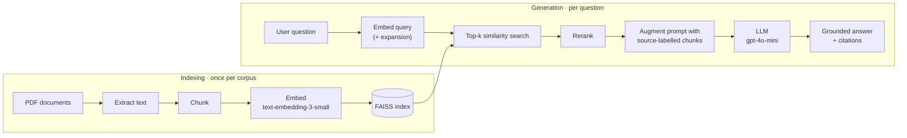

# Document Q&A with RAG — ICoDSE 2025 Workshop


Materials for the hands-on session **"Studi Kasus: Document Q&A"** at **ICoDSE 2025** (International Conference on Data and Software Engineering).

The workshop builds Retrieval-Augmented Generation (RAG) systems end to end: from raw PDFs to a grounded, source-citing answer in a web app. There are two case studies. Each one comes with a teaching notebook and a runnable Streamlit app.

| Case study | Question it answers | Corpus | Built with |
|---|---|---|---|
| [**JDIH RAG**](JDIH_RAG/) | *"What are the rules for X at ITB?"* in Indonesian, with cited sources | 4 official ITB regulations (bundled) | LangChain · FAISS · OpenAI · Streamlit · Docker |
| [**CV Screening RAG**](cv_screening_rag/) | *"Who has strong Python + SQL experience?"* over a stack of CVs | Your own PDF resumes (uploaded) | OpenAI SDK · FAISS · Streamlit · Docker (no framework) |

Both projects use the same pipeline. JDIH RAG shows the framework route and adds retrieval improvements such as query expansion, reranking and metadata-rich context. CV Screening RAG builds that pipeline in about 100 lines of plain Python, so you can see exactly what the framework is doing for you.

## How it works



## Workshop flow

1. **Indexing pipeline.** In [`workshop_jdih.ipynb`](JDIH_RAG/notebooks/workshop_jdih.ipynb) you load the regulations, chunk them, check the chunk-size distribution, embed the chunks and store them in FAISS.
2. **Generation pipeline.** In the same notebook you retrieve relevant chunks, add them to the prompt and generate an answer that stays within the retrieved context.
3. **Domain prompting.** The second half of the notebook covers legal-analysis prompt templates for compliance questions, procedures, and rights and obligations.
4. **From notebook to product.** The [JDIH Streamlit app](JDIH_RAG/app/streamlit_app.py) lets you change the chunking strategy, top-k, query expansion and reranking, and watch the retrieved context change.
5. **Framework-free RAG.** The [CV Screening app](cv_screening_rag/) runs the same pipeline with only the OpenAI SDK and FAISS.

## Quick start

**Prerequisites:** an [OpenAI API key](https://platform.openai.com/api-keys), plus Python 3.10 or 3.11 or Docker. JDIH RAG pins `numpy` 1.24 and `faiss-cpu` 1.7, and neither ships wheels for Python 3.12+. The two projects have separate dependency sets, so give each one its own virtual environment.

```bash
git clone https://github.com/AustinPardosi/Workshop-ICoDSE-2025-RAG-Document-QA.git
cd Workshop-ICoDSE-2025-RAG-Document-QA/JDIH_RAG

python -m venv .venv && source .venv/bin/activate     # Windows: .venv\Scripts\activate
pip install -r requirements.txt
cp .env.example .env                                  # then set OPENAI_API_KEY

streamlit run app/streamlit_app.py                    # http://localhost:8501
```

In the sidebar, click **Build/Rebuild Index**, then ask a question or pick one of the examples.

To use Docker instead, run `docker compose up --build` inside `JDIH_RAG/` or `cv_screening_rag/`. Setup details for each project are in its own README.

## Repository layout

```
.
├── JDIH_RAG/                    # Case study 1: regulation Q&A (LangChain)
│   ├── app/streamlit_app.py     #   Streamlit UI
│   ├── rag/rag_core.py          #   chunking, retrieval, reranking, prompting, metrics
│   ├── notebooks/               #   workshop notebook (indexing → generation → legal prompting)
│   ├── data/                    #   bundled ITB regulation PDFs
│   ├── Dockerfile, docker-compose.yml, run-docker.sh/.bat
│   └── requirements.txt
└── cv_screening_rag/            # Case study 2: CV screening (plain OpenAI SDK + FAISS)
    ├── app/streamlit_app.py
    ├── rag/rag_core.py
    ├── notebooks/CV_Screening_RAG.ipynb
    ├── Dockerfile, docker-compose.yml
    └── requirements.txt
```

## Design notes and limitations

The code is kept simple on purpose so that every part can be read during the session. Here is where it stops and what a production system would add:

- **Retrieval quality signals are not an evaluation.** The coverage, diversity and confidence scores in the JDIH app are lexical heuristics that help you see how retrieval behaves. A real evaluation needs a labelled question-and-answer set, measuring both retrieval recall and answer faithfulness (for example with [RAGAS](https://github.com/explodinggradients/ragas)).
- **Reranking is a weighted blend of 0.7 × cosine similarity and 0.3 × keyword overlap.** A cross-encoder reranker is the natural next step.
- **Query expansion uses a small hand-written Indonesian synonym list.** For a larger corpus, LLM-based query rewriting or hybrid search (BM25 plus vectors) would work better.
- **The FAISS flat index lives in the same process as the app.** That is fine for thousands of chunks. For multiple users or larger corpora, use a managed vector database such as pgvector, Qdrant or Pinecone.
- **Data leaves your machine.** Document chunks and questions are sent to the OpenAI API. Only upload CVs you have consent to process.

## Data

The JDIH corpus is made of public regulations issued by Institut Teknologi Bandung. JDIH stands for *Jaringan Dokumentasi dan Informasi Hukum*, the legal documentation network.

| File | Document |
|---|---|
| `PerRektor-316-2022-Kemahasiswaan.pdf` | Peraturan Rektor ITB No. 316/2022: Kemahasiswaan (student affairs) |
| `SE-777-2025-MAPAK.pdf` | Surat Edaran No. 777/2025: MAPAK, the new-student orientation programme |
| `SE-646-2025-Standar-Tenan-Event-K3L.pdf` | Surat Edaran No. 646/2025: health and safety (K3L) standards for food tenants at campus events |
| `SE-184-2025-Pembelajaran-Libur-Nyepi-Idul-Fitri.pdf` | Surat Edaran No. 184/2025: learning arrangements during the Nyepi and Idul Fitri 2025 holidays |

The repository does not include any CVs. Upload your own.

## Contributors

- [@AustinPardosi](https://github.com/AustinPardosi)
- [@akhmadst1](https://github.com/akhmadst1)
